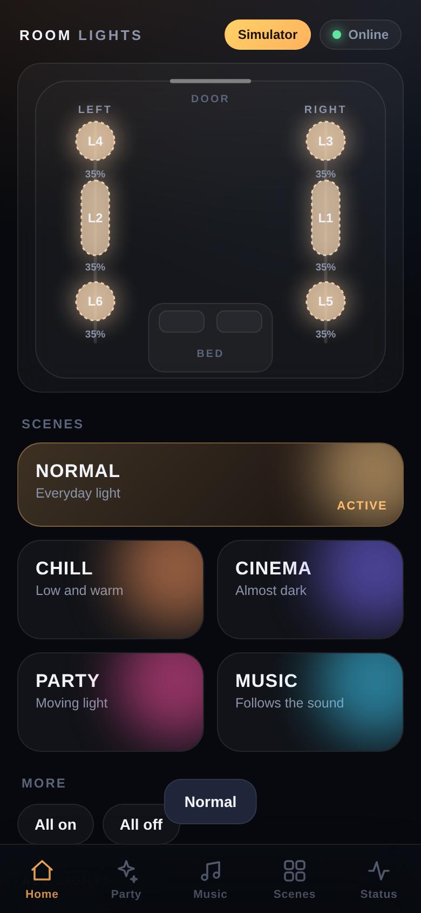
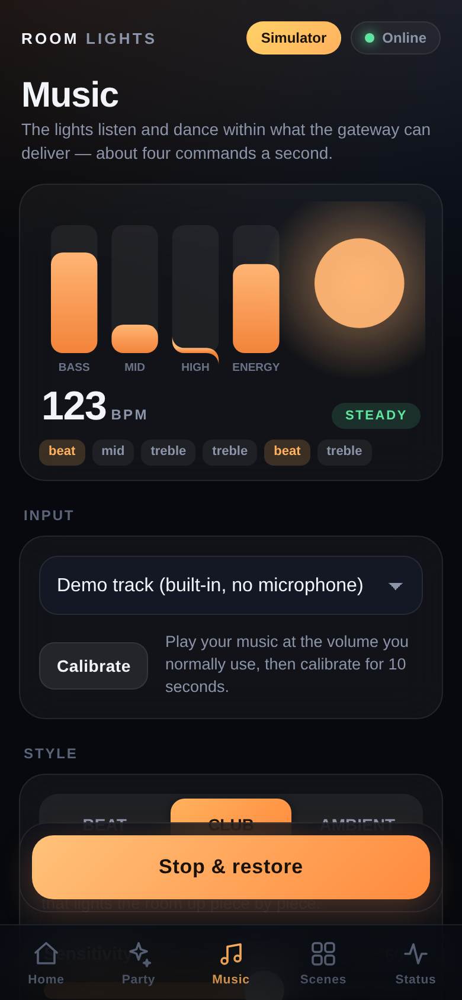
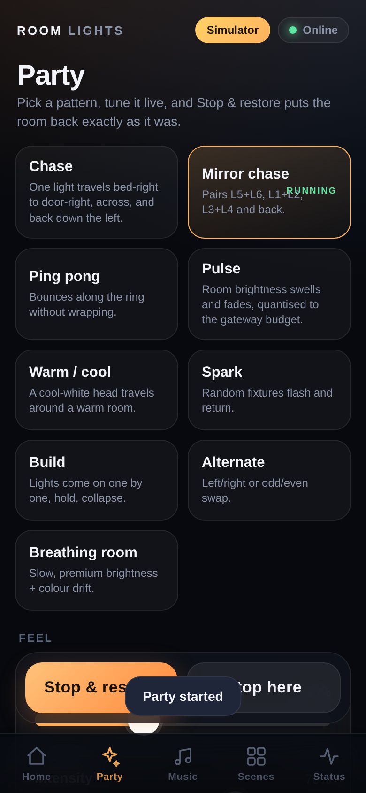

# Room Lights — local party / music controller for the Tuya track lights

Six track lights (3 on the left rail, 3 on the right) driven **locally** through the Tuya WG-S gateway over your LAN —
no Tuya Cloud at run time. A premium dark, iPhone-first web UI, nine light effects, a music mode that reacts to
beats / drops / energy, scenes you can edit, a built-in simulator, and a PIN-paired, LAN-only access model.

  

## Use it (Windows laptop)

1. Keep your secret config in `config\` (`tuya_devices.json`, `tuya_fixtures.json`, … — they are git-ignored and never uploaded).
2. Double-click **`START_LIGHTS.bat`**. A page opens with a QR code.
3. Scan the QR code with the iPhone camera (same Wi-Fi) → Share → *Add to Home Screen*. (iOS keeps a Home-Screen app's storage separate from Safari, so open the new icon once and type the 6-digit PIN shown on the laptop / in Status.)
4. **`STOP_LIGHTS.bat`** (or Ctrl+C in the window) stops everything and restores the room.

First time only: run **`ALLOW_PHONE_ACCESS.bat`** as Administrator so Windows Firewall lets your phone in (private networks only).
No lights nearby? **`START_SIMULATOR.bat`** runs the identical app against a simulated gateway and six simulated lamps.

## What is in the app

| Tab | |
|---|---|
| **Home** | Live room view (LEFT `L6 → L2 → L4`, RIGHT `L5 → L1 → L3`, bed → door; brightness + warm/cool colour per light), scenes **NORMAL · CHILL · CINEMA · PARTY · MUSIC**, master brightness/colour. Tap a light → on/off, brightness, colour temperature. |
| **Party** | 9 effects (chase, mirror chase, ping pong, pulse, warm/cool, spark, build, alternate, breathing), speed, intensity, direction, peak brightness, base glow, colour range — all live. *Stop & restore* puts the room back exactly as it was. |
| **Music** | Input device, 10-second calibration, sensitivity, **BEAT / CLUB / AMBIENT**, live audio visualisation (bass / mid / high / energy, BPM, section, events). A built-in demo track lets you test the whole path with no microphone. |
| **Scenes** | Edit any scene (all lights + each light), capture the room as it is now, create / delete custom scenes, reset built-ins. |
| **Status** | Gateway state, command budget, queue, reconnects, log, simulator panel, QR/PIN to pair more phones, stop the controller. |

## How it works

```
 audio source ─► features ─► event detector ─► bounded event queue ─► profile (BEAT/CLUB/AMBIENT) ─┐
 (mic / demo)    (RMS, bass,   (onsets, beats,   (drops the OLDEST;     (event-driven cues,        │ cues
                 mid, treble,  tempo, build,     stale events skipped)   music command budget)     ▼
                 spectral      drop, breakdown,                                              ┌───────────┐
                 flux)         silence)                  effects (9) / scenes / taps ──────► │ Scheduler │ ─► gateway link ─► WG-S ─► lamps
                                                                                             └───────────┘   (one persistent socket)
```

* **Audio never drives Tuya directly.** Audio runs at ~43 frames/s; the lights only ever see a handful of *musical events*
  per second, turned into cues that fit a command budget.
* **One scheduler, one writer.** Priority classes (CRITICAL > HIGH > NORMAL > LOW), ~4 commands/s global limit, coalescing
  (newest value wins), TTL for stale cues, epochs so two effects can never fight, in-flight tracking, self-healing.
* **Hardware code is the verified code.** `hardware/tuya_lan.py`, `hardware/gateway_link.py`, the scheduler's limits and the nine
  effects are the ones tested on your lights. The simulator plugs in *below* the same link/supervisor code
  (`hardware/simulator.py`), so reconnect / back-off / failure-streak logic runs unchanged.
* Details: [docs/ARCHITECTURE.md](docs/ARCHITECTURE.md). Hardware facts and measurements: [HARDWARE_DISCOVERY.md](HARDWARE_DISCOVERY.md).

Hardware facts the code relies on: 6 gateway children addressed by cid · LAN protocol 3.3, TCP 6668 · one persistent socket ·
brightness DP22 10–1000 · colour temperature DP23 0–1000 where **1000 = warm, 0 = cool** · ≈4 commands/s ceiling.

## Security model

* **LAN only:** any client that is not loopback / RFC1918 / link-local is refused (explicit allow-list).
* **PIN pairing:** a random 6-digit PIN (`config/auth.json`, git-ignored). The QR code on the laptop carries it, so phones pair with
  one scan; the phone then holds a signed, HttpOnly, SameSite=Strict cookie. 5 wrong PINs → 60 s lock-out. The laptop itself
  (localhost) needs no PIN. *New pairing PIN* in Status signs everybody out.
* **Browser attacks:** state-changing requests must come from the same origin (CSRF), and the `Host` header must be an IP /
  localhost / `.local` name (DNS-rebinding). No interactive API docs are served.
* **Secrets** (`.env`, `config/tuya_*.json`, `config/auth.json`, …) are git-ignored and never sent to the UI. Normal operation uses
  no Tuya Cloud and no internet.
* Not designed to be exposed to the internet — do not port-forward it.

## Configuration

Defaults < `config/settings.json` < `LIGHTS_*` environment variables. See `core/settings.py` (`port`, `rate`, `music_budget`,
`require_pin`, `lan_only`, `trust_localhost`, `simulate`, `sim_latency_ms`, …). Topology: `config/layout.json`. Scenes you edit:
`config/scenes.json`. Music calibration: `config/music_calibration.json`. Logs: `logs/lights.log` (rotating) and *Status → Log*.

## Develop & test

```
pip install -r requirements-dev.txt
python run.py --simulate            # whole app on the simulator   (http://localhost:8080)
pytest                              # everything (~4 min); -m "not endurance and not e2e" for the quick set
ruff check . && mypy .
python tools/api_smoke.py --base http://localhost:8080 --quick     # drives a running controller through its API
```

### What has been verified, and how

| Label | Meaning |
|---|---|
| ✅ **VERIFIED ON REAL HARDWARE** (earlier local session) | Gateway LAN control of all 6 lamps, DP ranges/directions, ≈4 cmd/s ceiling, persistent socket, chase/mirror and the other 7 effects judged by eye, raw-exact restore. |
| 🧪 **SIMULATOR VERIFIED** (this repo's tests) | Scheduler priority / coalescing / TTL / epochs / in-flight handling / rate limit; all effects stay inside the budget; controller modes, STOP & restore, NORMAL, crash-recovery; music engine on synthetic audio; API, WebSocket, auth; mobile UI in a browser at iPhone size; production start-up; **30-minute Party and 30-minute Music sessions** with a gateway outage in each; 100+ randomised operation sequences. |
| ⚠️ **REAL HARDWARE VERIFICATION REQUIRED** | Everything in [REAL_HARDWARE_CHECKLIST.md](REAL_HARDWARE_CHECKLIST.md): music on a real microphone, the new UI on the real lights, reconnect after a real gateway/Wi-Fi drop, phone + firewall, real-lamp restore, long soak. |

Simulator results never claim anything about the physical lights: the simulator models latency (~200 ms), serialisation, the
command-rate ceiling and outages, not the lamps' optics or the gateway's quirks. Numbers from the 30-minute runs:
[reports/sim_endurance_summary.json](reports/sim_endurance_summary.json).

## Project layout

```
run.py  START_LIGHTS.bat  STOP_LIGHTS.bat  START_SIMULATOR.bat  ALLOW_PHONE_ACCESS.bat
api/       server.py (REST + WebSocket + static)   auth.py (LAN gate, PIN, CSRF / rebinding guard)
core/      scheduler.py  effects.py  controller.py  scenes.py  model.py  params.py  settings.py  net.py  logbuf.py
audio/     sources.py (demo song, sounddevice)  features.py  analyzer.py (onsets, beats, sections, calibration)
           profiles.py (BEAT / CLUB / AMBIENT)  director.py
hardware/  tuya_lan.py + gateway_link.py (REAL)  simulator.py (SIM)  probe_* / tuya_ble_direct.py (discovery history)
web/       index.html  app.css  app.js  login.html  connect.html  manifest.webmanifest  sw.js  icons/
config/    layout.json (topology) · tuya_fixtures.example.json · (git-ignored: tuya_devices.json, tuya_fixtures.json, auth.json, …)
tests/     unit + simulator + API + browser tests        tools/  login, identify, benchmarks, api_smoke
```

## Known limits

* ≈4 commands/s is a hard property of the gateway: music is event-style (beat → move one light / one pair), not per-frame.
* A PWA over plain `http://` on the LAN cannot use a service worker on iOS; *Add to Home Screen* still gives a full-screen app
  (it just needs the laptop to be running).
* System-audio capture on Windows needs an input that carries it (a microphone, or "Stereo Mix" if your sound driver offers it).
